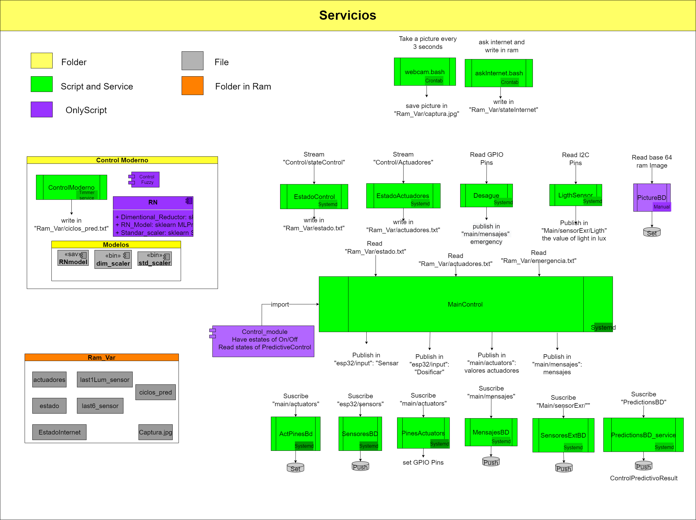

# Management system
This folder contains the documentation of the management system

The Management System it's implemented under services architecture using systemd and crontab in Linux with scripts in Python and Bash.

- Complete diagram of the architecture of services, modules and components

- Description of each script

- Script codes

- Service codes

