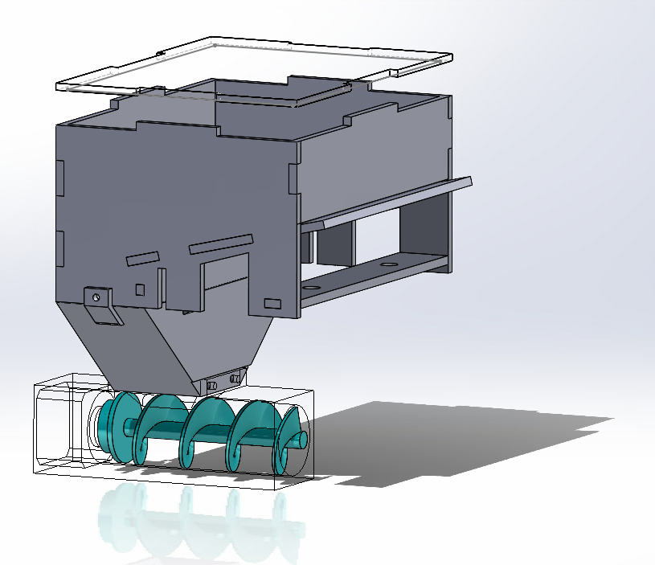
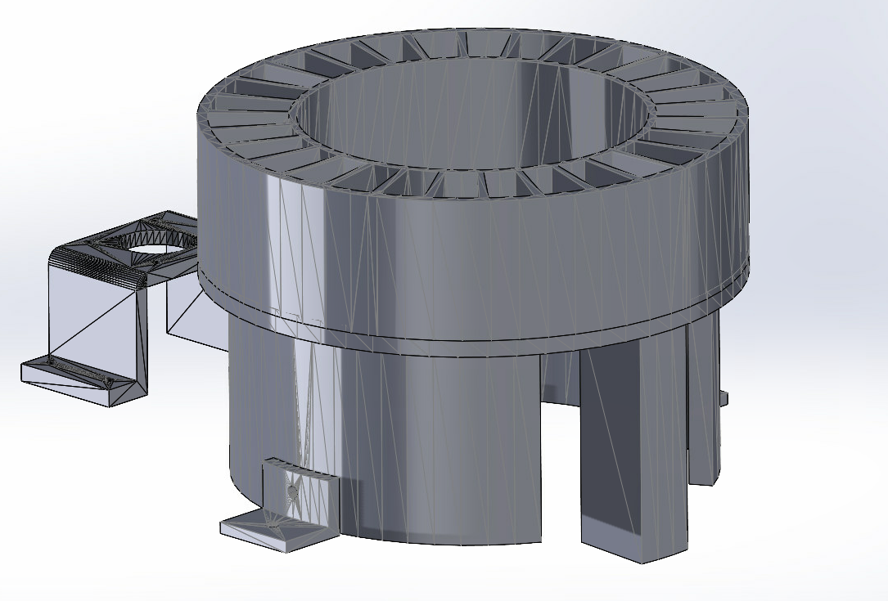

# Dosage
STL files of the 2 versions of the feder together with an assembly 3d diagram

-Feeder Version 1: Feeder by storage hopper and endless screw driven by nema 17.

-Feeder Version 2: volumetric type doser by cell rotation powered by nema 17 and set of pulleys.

