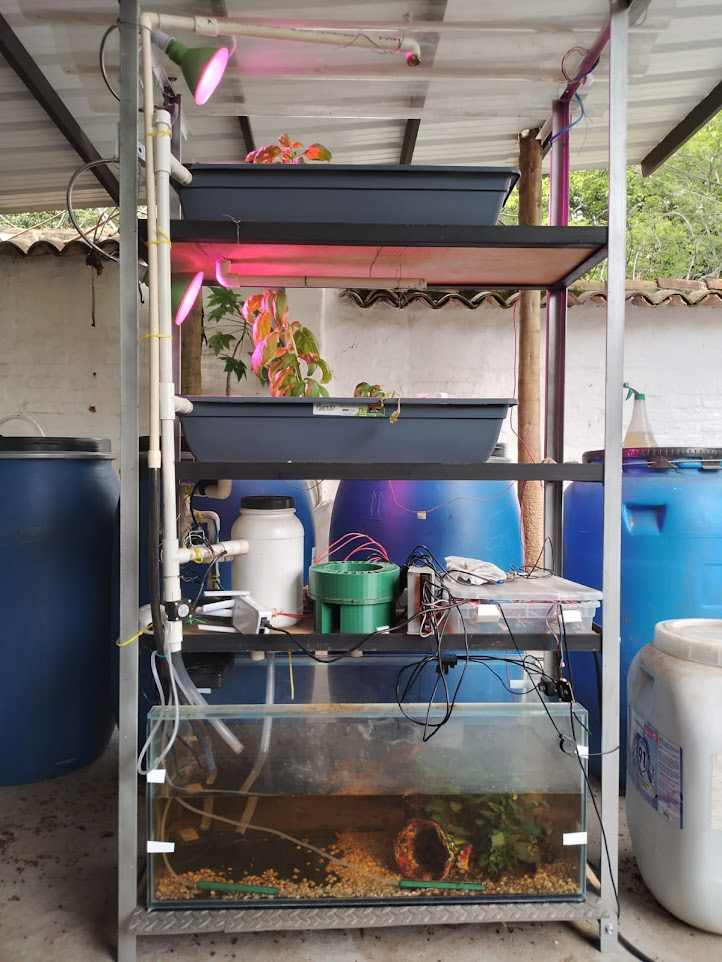

# Degree_Project-AquaponicCrop

In this repository you will find the documentation of the degree work "Design and implementation of an automation and control system for aquaponic crops in urban areas".

The main document is written in Spanish, but the documentation in this repository is in English.

Authors: 
- Luis Fernando Riveros Orozco
- Karen Yissel Marin Franco

Thesis director:
- Juan Manuel Nogales

## Project summary
The project is the assembly of an aquaponic crop and the implementation of an automation system using hybrid predictive control with fuzzy to control the active elements of the crop.

The entire project is divided into the following components:
- Physical structure
- Web page
- IoT
- Control
- Management system

Resume of the project:
This work presents an automation and control system for aquaponic crops in urban environments by employing a modern multivariable control technique. The prototype reached a level 7 on the Technology Readiness Level (TRL) scale and consists of an aquaponic crop in which water luminosity and temperature are controlled through a hybrid predictive control with fuzzy logic applied to four fundamental control variables: water oxygenation, circulation and aeration, and plant luminosity.

To operate the automation system, a webpage was built to provide access to remote control, supervision, and monitoring functionalities, as well as a management system based on Linux services and communicates via MQTT. The automation system uses a local network that allows communication between different system components (sensors, actuators, microprocessor, and microcontroller) and is capable of detecting internet connectivity status and taking actions in case of failure. Furthermore, the prototype demonstrates complete autonomy for a period of 3-5 days, attributed to the incorporation of a feeding dispenser. Moreover, the prototype also exhibits a semi-autonomous functionality of up to 20 days, achieved by regular replenishment of the dispenser every 4 days and maintenance of the filters by cleaning every 6 days
